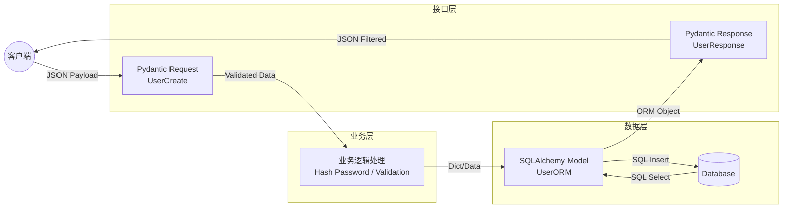

# FastAPI 项目数据结构选型指南

本指南旨在规范 FastAPI 项目中各类数据对象的使用，明确分层架构，防止代码耦合。

## 1\. 四大金刚：角色定位总表

我们在原有基础上增加了 **SQLAlchemy ORM**，形成了完整的后端数据链路。

| 工具 | 核心特性 | 在架构中的角色 | 所属层级 (Layer) |
| :--- | :--- | :--- | :--- |
| **Pydantic** | 运行时校验、序列化、文档生成 | **门面 (DTO)** | **接口层 (API/Web)** <br> 负责进出网关的数据清洗 |
| **SQLAlchemy** | 映射数据库表、关系管理、SQL 生成 | **存储 (Entity)** | **数据层 (Repository/DB)** <br> 负责持久化数据 |
| **@dataclass** | 轻量、支持业务方法、无校验开销 | **核心 (Domain)** | **服务层 (Service)** <br> 负责纯粹的业务逻辑运算 |
| **NamedTuple** | 不可变、内存极小 | **工具 (Utils)** | **通用层 (Common)** <br> 负责简单的多值传递 |

-----

## 2\. 详细选型与最佳实践

### 2.1 数据库层：SQLAlchemy ORM Models

**场景：** 定义数据库表结构、外键关系。
**核心原则：** **ORM 模型仅用于与数据库交互。严禁直接作为 API 响应返回给前端（必须经过 Pydantic 转换）。**

  * **最佳实践：**

    1.  **使用 SQLAlchemy 2.0 语法：** 使用 `DeclarativeBase` 和 类型注解 (`Mapped[...]`)，这与 Python 的类型系统结合得最好。
    2.  **区分 Nullable：** 数据库层面的 `nullable=True` 和 Pydantic 的 `Optional` 必须严格对应，否则会出错。
    3.  **不要包含复杂业务逻辑：** ORM 模型应该很“笨”，只包含数据和关系。复杂的计算（如计算折扣后的价格）应放在 Service 层的 dataclass 或 Service 类中，或者使用 `@property`。

  * **代码范例 (SQLAlchemy 2.0)：**

<!-- end list -->

```python
from sqlalchemy import String, ForeignKey
from sqlalchemy.orm import DeclarativeBase, Mapped, mapped_column, relationship

class Base(DeclarativeBase):
    pass

# [DB Layer] 对应数据库中的 'users' 表
class UserORM(Base):
    __tablename__ = "users"

    id: Mapped[int] = mapped_column(primary_key=True)
    username: Mapped[str] = mapped_column(String(50), unique=True)
    password_hash: Mapped[str] = mapped_column(String) # 敏感数据！
    
    # 关系定义
    items: Mapped[list["ItemORM"]] = relationship(back_populates="owner")
```

-----

### 2.2 接口层：Pydantic (`BaseModel`)

**场景：** 处理 HTTP 请求体 (Request Body) 和 响应体 (Response Body)。
**与 ORM 的交互：** 它是 ORM 模型的“安全面具”。

  * **最佳实践：**

    1.  **屏蔽敏感字段：** 定义 `UserResponse` 时，**不要**包含 `password_hash` 字段。这是 Pydantic 存在的最大意义之一。
    2.  **ORM 模式 (`from_attributes`)：** 这是一个杀手级特性，允许 Pydantic 直接读取 SQLAlchemy 对象并转换为 JSON。

  * **代码范例：**

<!-- end list -->

```python
from pydantic import BaseModel, ConfigDict

# [API Layer] 响应模型
class UserResponse(BaseModel):
    id: int
    username: str
    # 注意：这里没有 password_hash，确保安全

    # 允许 Pydantic 读取 ORM 对象 (user.id) 而不仅仅是 dict (user['id'])
    model_config = ConfigDict(from_attributes=True)
```

-----

### 2.3 服务层：`@dataclass` (可选但推荐)

**场景：** 当业务逻辑非常复杂，不希望依赖 ORM 的 Session 状态，也不希望依赖 Pydantic 的校验性能损耗时。

  * **最佳实践：**
      * **解耦 DB：** 从数据库查出 `UserORM` 后，可以将其转换为纯净的 `UserDomain` dataclass，然后在内存中进行复杂的费率计算。这样做的好处是，业务逻辑单元测试不需要 mock 数据库连接。

-----

## 3\. 经典数据流转图 (The Data Flow)

理解这三个东西如何配合，是 FastAPI 项目的核心。



### 核心转换代码演示

这是开发者最容易写乱的地方，请参考标准写法：

```python
from fastapi import APIRouter, Depends
from sqlalchemy.orm import Session
# 假设已导入上述定义的 UserORM, UserCreateRequest, UserResponse, get_db

router = APIRouter()

@router.post("/users/", response_model=UserResponse)
def create_user(
    user_in: UserCreateRequest, # 1. Pydantic 接收并校验数据
    db: Session = Depends(get_db)
):
    # 2. 业务逻辑：处理数据 (例如 hash 密码)
    fake_hashed_password = user_in.password + "hashed"
    
    # 3. 转换：Pydantic -> SQLAlchemy ORM
    # 注意：这里我们手动映射，或者使用 user_in.model_dump() 配合解包
    db_user = UserORM(
        username=user_in.username,
        password_hash=fake_hashed_password
    )
    
    # 4. 持久化
    db.add(db_user)
    db.commit()
    db.refresh(db_user) # 获取生成的 ID
    
    # 5. 返回：SQLAlchemy ORM -> Pydantic
    # FastAPI 会利用 response_model=UserResponse 自动调用 from_attributes 逻辑
    # 自动过滤掉 password_hash
    return db_user 
```

-----

## 4\. 决策树 (更新版)

1.  **我要定义数据库表结构？**

      * 👉 **SQLAlchemy Model** (继承 `DeclarativeBase`)

2.  **前端发给我的 JSON 数据格式？**

      * 👉 **Pydantic BaseModel** (Request Schema)

3.  **我要发给前端的 JSON 数据格式？**

      * 👉 **Pydantic BaseModel** (Response Schema，配置 `from_attributes=True`)

4.  **我在写纯业务逻辑，不需要校验也不存库，只在内存里跑？**

      * 👉 **@dataclass**

5.  **我在写一个工具函数，只需要返回两个值？**

      * 👉 **NamedTuple**

-----

## 5\. 常见坑点 (Pitfalls)

1.  **Lazy Loading 错误：**

      * 当你把 ORM 对象传给 Pydantic 进行序列化时，如果 Pydantic 尝试访问一个未加载的关系字段（Relationship），且此时 DB Session 已经关闭，程序会崩溃。
      * *解决：* 在查询时使用 `options(joinedload(...))` 预加载数据，或者确保 Pydantic 转换发生在 Session 关闭之前。

2.  **混合使用：**

      * 不要试图让一个类同时继承 `BaseModel` 和 SQLAlchemy 的 `Base`（虽然 SQLModel 做了这件事，但如果你使用原生库，请保持分离）。**“读写分离”在类定义上非常重要。**

这个文档现在涵盖了从数据库到 API 的完整链路，非常适合作为团队的新人培训材料。
