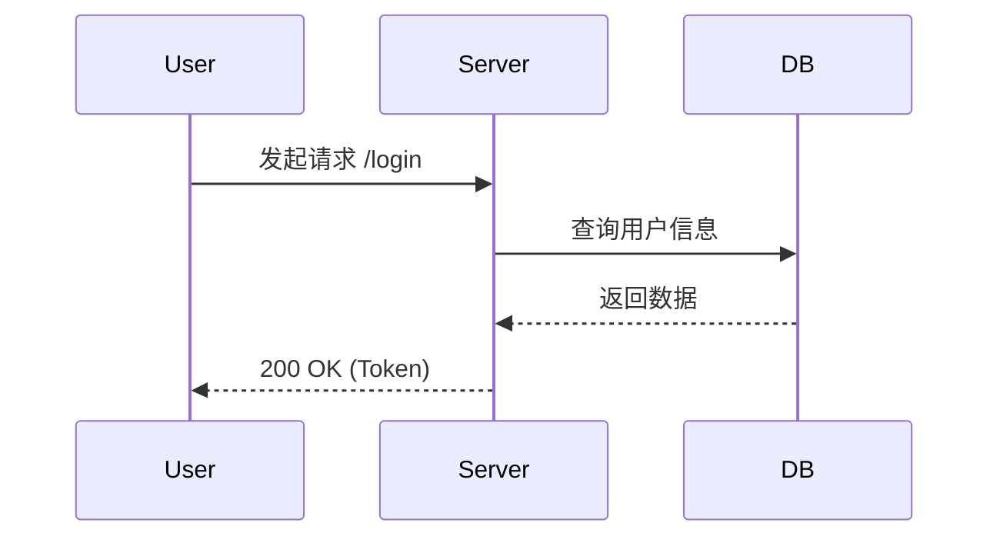
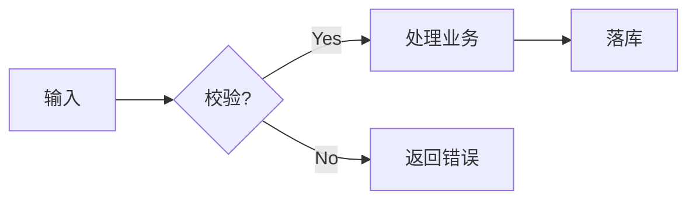

`````markdown
# 程序员常用 Markdown 语法速查（含高频示例）

> 💡 **提示**：本文档本身即展示了规范的 Markdown 写法。文中演示了如何在 Markdown 中显示“反引号”包裹的代码块（嵌套技巧）。

## 1. 基础排版

**标题与段落**

```markdown
# H1 一级标题（文档标题）
## H2 二级标题（章节）
### H3 三级标题（子章节）

普通段落之间使用空行分隔。
如果需要在行尾强制换行，请在行尾添加两个空格。  
或者使用 HTML 的 <br> 标签。
```

**强调与行内样式**

```markdown
**加粗 (Bold)**
*斜体 (Italic)*
~~删除线 (Strikethrough)~~
`行内代码 (Inline Code)`

HTML 标签支持：
<sub>下标</sub> 和 <sup>上标</sup>
<kbd>Ctrl</kbd> + <kbd>C</kbd>
```

**分隔线**

```markdown
---
```

## 2. 列表与任务清单

```markdown
无序列表：
- 项目 A
- 项目 B
  - 子项目 B-1（缩进 2 空格）

有序列表：
1. 第一步
2. 第二步

任务清单 (Task List)：
- [ ] 待办事项
- [x] 已完成事项
```

## 3. 链接与图片

```markdown
[显示的文本](https://example.com "可选的鼠标悬停标题")

<https://example.com>

请参考 [官方文档][docs] 和 [API 说明][api]。

[docs]: https://example.com/docs
[api]: https://example.com/api


```

## 4. 代码块（含语法高亮）

````markdown
行内代码：`npm install`

多行代码块（指定语言）：
```python
def hello():
    print("Hello World")
```

Diff 代码块（展示修改对比）：
```diff
- const isLogin = false;
+ const isLogin = true;
```
`````

## 5\. 引用与提示块 (Callouts)

GitHub 风格的警告块（Alerts）：

```markdown
> 普通引用文本
> 可以换行。

> [!NOTE]
> 这是提示信息 (Note)。

> [!TIP]
> 这是技巧建议 (Tip)。

> [!WARNING]
> 这是警告信息 (Warning)。
```

## 6\. 表格 (GFM)

```markdown
| 字段 | 类型   | 必填 | 说明       |
| :--- | :----- | :--: | ---------- |
| id   | int    |  是  | 主键 ID    |
| name | string |  否  | 用户昵称   |

```

## 7\. 公式 (需平台支持 LaTeX)

```markdown
行内公式：$E = mc^2$

块级公式：
$$
f(x) = \int_{-\infty}^\infty \hat f(\xi)\,e^{2\pi i \xi x} \,d\xi
$$
```

## 8\. 折叠/详情 (HTML)

用于收纳长配置或不重要的日志：

````html
<details>
<summary>点击展开查看详细配置</summary>

```yaml
server:
  port: 8080
  log_level: INFO
```

</details>
````

## 9\. 流程图 (Mermaid)

需平台（如 GitHub, GitLab, Notion, VS Code）支持：



## 10\. 文档工程化建议

1.  **语义化换行**：建议“一句话占一行”，不要在段落中间硬回车，利于 Git diff 版本对比。
2.  **相对路径**：引用仓库内图片时始终使用 `./assets/img.png`，确保在 GitHub 和本地都能预览。
3.  **代码块语言**：务必标注语言（如 `json`, `bash`, `sql`），这不仅是为了高亮，也利于搜索。
4.  **格式化工具**：推荐在 VS Code 中配置 `Prettier` 或使用 `markdownlint` 保持风格统一。

-----

## 附：可复用文档模板 (Copy & Paste)

你可以直接复制下面的代码块内容，作为新文档的起手式：

````markdown
# [文档标题]

> 简介：一句话说明该文档的目标受众与核心价值。

## 1. 背景与目标
* **背景**：为什么要做这件事？
* **目标**：预期达成什么效果？

## 2. 快速开始 (Quick Start)

### 环境依赖
* Python >= 3.8
* Node.js >= 16

### 安装与运行

```bash
# 安装依赖
npm install

# 启动服务
npm run dev
```

## 3. 架构/流程设计



## 4. API 示例

```python
import requests

res = requests.get("[https://api.example.com/v1/data](https://api.example.com/v1/data)")
print(res.json())
```

## 5. 常见问题 (FAQ)

* **Q: 遇到权限报错怎么办？**
    * A: 请检查 `.env` 文件中的 token 是否过期。

## 6. 参考资料
* [需求文档 (Jira)](https://...)
* [技术方案 (Wiki)](https://...)
````

```

### 接下来可以做的事

Would you like me to:
1.  Create a `.prettierrc` configuration file snippet tailored for Markdown to help you maintain this format automatically?
2.  Convert this guide into a PDF version for distribution?
3.  Add more complex Mermaid examples (like State Diagrams or Gantt charts)?
```