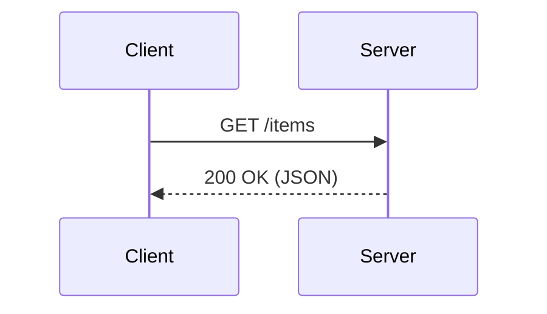

# 程序员常用 Markdown 语法速查（含高频示例）

## 基础排版

**标题与段落**

```md
# H1 标题
## H2 小节
### H3 小小节

普通段落用空行分隔。  
行尾两个空格 = 强制换行。
```

**强调与行内**

```md
**加粗**  *斜体*  ~~删除线~~  `行内代码`  
<sub>下标</sub> 和 <sup>上标</sup>（HTML 支持）
```

**分隔线**

```md
---
```

## 列表与任务清单

```md
- 无序 1
- 无序 2
  - 子项

1. 有序 1
2. 有序 2

- [ ] 待办（任务清单，GFM）
- [x] 已完成
```

## 链接与图片

```md
[可读文本](https://example.com "可选标题")
<https://example.com>  <!-- 自动链接 -->

[引用式链接][doc]
[doc]: https://example.com/docs "统一管理链接"


```

> 需要控制尺寸/对齐时，可用 HTML：
> ``

## 代码块（含语法高亮）

````md
行内：`pip install fastapi`

多行（标注语言以启用高亮）：
```python
from fastapi import FastAPI
app = FastAPI()
````

差异高亮（审阅改动很实用）：

```diff
- old_value = False
+ old_value = True
```

````

## 引用与提示块
```md
> 这是引用。
> 可多行。

> [!NOTE]（GitHub Callouts 扩展）
> 这里是说明/提示。

> [!WARNING]
> 这里是风险/注意事项。
````

## 表格（GFM）

```md
| 字段 | 类型    | 说明       |
| ---- | ------- | ---------- |
| id   | int     | 主键       |
| name | string  | 名称       |

对齐：
| 左对齐 | 居中 | 右对齐 |
| :----- | :--: | -----: |
| a      |  b   |      c |
```

## 脚注（GFM）

```md
这是一个带脚注的句子[^ref]。
[^ref]: 脚注内容放这里。
```

## 公式（平台支持则可用）

* **行内**：`$E = mc^2$`
* **块级**（常用 KaTeX/MathJax 渲染）：

```md
$$
\int_0^1 x^2\,dx = \tfrac{1}{3}
$$
```

## 折叠/详情（HTML）

````html
<details>
  <summary>展开查看示例配置</summary>

  ```yaml
  log_level: INFO
  retries: 3
````

</details>
```

## 流程图/时序图（Mermaid，GitHub/MkDocs 等支持）



## 转义与特殊字符

```md
要显示字面量 * 或 _ 等符号：使用反斜杠转义，例如 \*literal\*。
要显示反引号：`` 用两个反引号把 ` 包起来 ``。
```

## 文档工程化建议（写多了更省心）

* **语义化换行**：一句话一行（便于 Git diff、评审）。
* **统一风格**：用 Prettier/markdownlint 自动格式化与规则校验。
* **相对路径**：图片和文档间互链尽量用相对路径，方便跨仓或打包。
* **标题层级清晰**：每篇文档只用一个 `#` 作为文档标题，内容从 `##` 开始。
* **代码块标注语言**：利于高亮与复制；终端命令用 `bash`/`sh`。
* **可维护链接**：多处复用的链接用“引用式链接”集中管理。
* **图像可访问性**：`alt` 必写；必要时提供图像下的简要说明。

## 可复用模板（拿去就能写）

````md
# 文档标题

> 简介：一句话说明这篇文档解决什么问题 / 读者是谁。

## 背景
- 场景/痛点
- 目标和不在范围

## 快速开始
```bash
# 安装
pip install yourpkg
# 运行
yourpkg --help
````

## 使用示例

```python
from yourpkg import Client
c = Client()
print(c.ping())
```

## 设计/原理（可选）

* 核心流程（见下方 Mermaid）


## 常见问题

* Q：...
* A：...

## 参考

* [链接 1](https://example.com)
* [链接 2](https://example.com)

